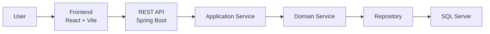

# 🎓 Club Management System

> A full-stack club management platform for student organizations and academic clubs.  
> The system supports member management, event organization, finance tracking, resource/document workflows, notifications, dashboard reporting, account management, and system settings.

<p align="center">
  
  
  
  
  
</p>

---

# 📚 Table of Contents

- [Overview](#-overview)
- [Core Features](#-core-features)
- [System Architecture](#-system-architecture)
- [Tech Stack](#-tech-stack)
- [Project Structure](#-project-structure)
- [Environment Requirements](#-environment-requirements)
- [Installation & Setup](#-installation--setup)
- [Environment Configuration](#-environment-configuration)
- [Sample Accounts](#-sample-accounts)
- [Main API Modules](#-main-api-modules)
- [Testing & Build](#-testing--build)
- [Development Conventions](#-development-conventions)
- [Future Improvements](#-future-improvements)
- [Contributors](#-contributors)
- [License](#-license)

---

# 📖 Overview

Club Management System is a modern full-stack application built for university clubs and student organizations.

The project focuses on solving common operational problems such as:

- Member registration, approval, search, filtering, and profile management
- Event creation, registration, attendance, organizer assignment, and evaluation
- Income, expense, revenue, and member due tracking
- Resource/document submission, review, approval, and file attachment workflows
- Notification delivery and recipient tracking
- Dashboard reporting, account management, and system settings

The architecture separates frontend and backend clearly for better scalability, maintainability, and testing.

---

# ✨ Core Features

## 👥 Member Management

- Register new club members
- Approve membership requests
- Search, filter, and update member profiles
- Manage departments, roles, and member statuses
- Display public club leaders and member lists

---

## 🎉 Event Management

- Create, update, delete, and search events
- Register or unregister members for events
- Track attendance and event participation
- Assign organizers and event roles
- Store event evaluations and generate calendar links
- Provide separate interfaces for administrators and members

---

## 💰 Finance Management

- Record income and expenses
- Track event-based financial activities
- Track monthly member dues and pending payments
- Calculate income, expenses, and revenue
- Export finance and event reports to spreadsheet files

---

## 📚 Resource & Document Management

- Submit and manage learning resources/documents
- Categorize resources by subject and document type
- Review, approve, reject, or request changes
- Manage document files and lookup folders
- Maintain document history and attachments

---

## 🔔 Notification, Account & Settings

- Create and send notifications
- Track notification recipients and read status
- Manage user accounts and passwords
- Store audit logs for system activities
- Configure departments, subjects, and monthly due settings

---

# 🏗️ System Architecture



---

## Backend Architecture

The backend follows a layered architecture:

| Layer | Responsibility |
| --- | --- |
| `controller` | Handle HTTP requests and responses |
| `application` | DTOs, mappers, service orchestration, and application rules |
| `domain` | Domain models, repositories, enums, and domain services |
| `config` | CORS, access control, async configuration, and sample data seeding |

---

## Frontend Architecture

| Folder | Responsibility |
| --- | --- |
| `pages` | Main application screens |
| `components` | Reusable UI, layout, and section components |
| `services` | API communication layer |
| `store` | Client-side state management |
| `data` | Local mock or static data used by screens |
| `hooks` | Reusable React hooks |
| `utils` | Shared utilities, API client, access control, and export helpers |

---

# 🛠️ Tech Stack

## Frontend

| Technology | Purpose |
| --- | --- |
| React 19 | UI framework |
| Vite 7 | Build tool |
| React Router 7 | Routing |
| Zustand 5 | Client-side state management |
| TanStack Query 5 | Server state helpers |
| Axios | HTTP client |
| CSS Modules | Component styling |

---

## Backend

| Technology | Purpose |
| --- | --- |
| Java 17 | Programming language |
| Spring Boot 4.0.2 | Backend framework |
| Spring Web MVC | REST API layer |
| Spring Data JPA | ORM layer |
| SQL Server | Database |
| Maven Wrapper | Dependency management and build execution |
| Lombok | Boilerplate reduction |

---

## Additional Libraries

| Library | Usage |
| --- | --- |
| ExcelJS | Excel export |
| file-saver | File download |
| xlsx | Spreadsheet handling |
| Lucide React | Icons |
| JUnit / Spring Boot Test | Backend testing |
| H2 | Backend test database |

---

# 📂 Project Structure

```text
club-management/
├── Backend/
│   ├── src/main/java/com/example/demo/
│   │   ├── application/
│   │   ├── config/
│   │   ├── controller/
│   │   ├── domain/
│   │   └── DemoApplication.java
│   ├── src/main/resources/
│   │   └── application.properties
│   ├── src/test/
│   ├── mvnw
│   ├── mvnw.cmd
│   └── pom.xml
│
├── Frontend/
│   ├── public/
│   ├── src/
│   │   ├── assets/
│   │   ├── components/
│   │   ├── data/
│   │   ├── hooks/
│   │   ├── pages/
│   │   ├── services/
│   │   ├── store/
│   │   └── utils/
│   ├── index.html
│   └── package.json
│
├── package.json
├── package-lock.json
├── LICENSE
└── README.md
```

---

# ⚙️ Environment Requirements

Install the following tools before running the project:

- Java Development Kit 17+
- Node.js 20+
- npm 10+
- SQL Server / SQL Server Express
- Git

Verify installations:

```bash
java -version
node -v
npm -v
git --version
```

---

# 🚀 Installation & Setup

## 1. Clone Repository

```bash
git clone https://github.com/ThankTran/club-management.git
cd club-management
```

---

## 2. Install Frontend Dependencies

```bash
cd Frontend
npm install
```

---

## 3. Configure Backend

Edit:

```text
Backend/src/main/resources/application.properties
```

Current local configuration:

```properties
spring.application.name=clubmanage

spring.datasource.url=jdbc:sqlserver://localhost:1433;databaseName=clubmanage;integratedSecurity=true;encrypt=true;trustServerCertificate=true;sendStringParametersAsUnicode=true
spring.datasource.driver-class-name=com.microsoft.sqlserver.jdbc.SQLServerDriver

spring.jpa.hibernate.ddl-auto=update
spring.jpa.show-sql=true
spring.jpa.properties.hibernate.format_sql=true
spring.jpa.properties.hibernate.use_nationalized_character_data=true

spring.sql.init.mode=always
spring.jpa.defer-datasource-initialization=true

server.port=8081
```

The backend uses `SampleDataSeeder` to insert sample data when the main lookup/member tables are empty.

---

## 4. Run Backend

### Linux / macOS

```bash
cd Backend
./mvnw spring-boot:run
```

### Windows PowerShell

```powershell
cd Backend
.\mvnw.cmd spring-boot:run
```

Backend URL:

```text
http://localhost:8081
```

---

## 5. Run Frontend

```bash
cd Frontend
npm run dev
```

Frontend URL:

```text
http://localhost:5173
```

---

# 🔧 Environment Configuration

Frontend uses the environment variable:

```env
VITE_API_URL=http://localhost:8081/api
```

Create this file when you need to override the default API URL:

```text
Frontend/.env
```

If not configured, the frontend uses:

```text
http://localhost:8081/api
```

---

# 👤 Sample Accounts

When the database is empty, `SampleDataSeeder` creates sample users for the first seeded members.

| User | Username | Password |
| --- | --- | --- |
| Seeded user 1 | `1` or `22130001` | `StudyHead@123` |
| Seeded user 2 | `2` or `22130002` | `EventHead@123` |
| Seeded user 3 | `3` or `22130003` | `Member01@123` |
| Seeded user 4 | `4` or `22130004` | `Member02@123` |
| Seeded user 5 | `5` or `22130005` | `Member03@123` |
| Seeded user 6 | `6` or `22130006` | `Member04@123` |

The login form sends `username` and `password`. The backend resolves a numeric username as a member ID first, then falls back to student ID lookup.

> These accounts are intended for development environments only.

---

# 🔌 Main API Modules

| Module | Endpoint |
| --- | --- |
| Authentication | `/api/auth` |
| Users | `/api/users` |
| Dashboard | `/api/dashboard` |
| Members | `/api/members` |
| Departments | `/api/departments` |
| Roles | `/api/roles` |
| Subjects | `/api/subjects` |
| Events | `/api/events` |
| Event Roles | `/api/event-roles` |
| Event Organizers | `/api/event-organizers` |
| Event Evaluations | `/api/event-evaluations` |
| Finance | `/api/finance` |
| Transactions | `/api/transactions` |
| Documents | `/api/documents` |
| Document Types | `/api/document-types` |
| Document Files | `/api/document-files` |
| Notifications | `/api/notifications` |
| Notification Recipients | `/api/notification-recipients` |
| Audit Logs | `/api/audit-logs` |
| System Settings | `/api/system-settings` |

---

# 🧪 Testing & Build

## Backend

Run tests:

```bash
cd Backend
./mvnw test
```

Build JAR:

```bash
cd Backend
./mvnw clean package
```

---

## Frontend

Run lint:

```bash
cd Frontend
npm run lint
```

Build production:

```bash
cd Frontend
npm run build
```

Preview production build:

```bash
cd Frontend
npm run preview
```

---

# 📏 Development Conventions

- Keep backend architecture aligned with:

  ```text
  controller -> application -> domain
  ```

- Avoid coupling DTOs directly with persistence entities
- Keep business rules inside application/domain services
- Route frontend API calls through `src/services` and the shared API client in `src/utils/api.js`
- Shared UI components belong in `src/components`
- Never commit real credentials or sensitive information

---

# 🛣️ Future Improvements

- Replace the current token helper with a stronger authentication mechanism
- Integrate Spring Security and BCrypt password hashing
- Standardize database changes with Flyway or Liquibase
- Add OpenAPI / Swagger documentation
- Expand automated testing coverage
- Add CI/CD pipelines for linting, testing, and deployment

---

# 🤝 Contributors

This project was developed by the following team members:

| Name | GitHub |
| --- | --- |
| Tran Thi Hong Thanh | [ThankTran](https://github.com/ThankTran) |
| Le Ngoc Minh Nhat | [Lenhat14810](https://github.com/Lenhat14810) |
| Nguyen Ai My | [my](https://github.com/my) |
| Pham Hoang Gia Hien | [hienpham0344](https://github.com/hienpham0344) |

---

# 📄 License

This project is licensed under the MIT License — see the [LICENSE](LICENSE) file for details.
