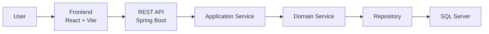

# 🎓 Club Management System

> A full-stack club management platform designed for student organizations and academic clubs.  
> The system supports member management, event organization, finance tracking, resource management, notifications, and internal operational workflows.

<p align="center">
  
  
  
  
  
</p>

---

# 📚 Table of Contents

- [Overview](#-overview)
- [Core Features](#-core-features)
- [System Architecture](#-system-architecture)
- [Tech Stack](#-tech-stack)
- [Project Structure](#-project-structure)
- [Environment Requirements](#-environment-requirements)
- [Installation & Setup](#-installation--setup)
- [Environment Configuration](#-environment-configuration)
- [Sample Accounts](#-sample-accounts)
- [Main API Modules](#-main-api-modules)
- [Testing & Build](#-testing--build)
- [Development Conventions](#-development-conventions)
- [Future Improvements](#-future-improvements)
- [License](#-license)

---

# 📖 Overview

Club Management System is a modern full-stack application built for university clubs and student organizations.

The project focuses on solving common operational problems such as:

- Member management
- Event organization
- Financial tracking
- Resource/document approval workflows
- Notification systems
- Internal activity monitoring

The architecture separates frontend and backend clearly for better scalability, maintainability, and testing.

---

# ✨ Core Features

## 👥 Member Management

- Register new club members
- Approve or reject membership requests
- Search, filter, and update member profiles
- Manage departments, roles, and statuses

---

## 🎉 Event Management

- Create and manage events
- Assign organizers and event roles
- Track registrations and participation
- Separate interfaces for admin and members

---

## 💰 Finance Management

- Record income and expenses
- Track event-based financial activities
- Generate Excel financial reports
- Calculate revenue, expenses, and balances

---

## 📚 Resource & Document Management

- Upload and manage documents
- Categorize resources by type and subject
- Approval and rejection workflows
- Maintain processing history and attachments

---

## 🔔 Notification System

- Create and send notifications
- Track notification recipients
- Store audit logs for system activities
- Manage internal system configurations

---

# 🏗️ System Architecture



---

## Backend Architecture

The backend follows a layered architecture:

| Layer | Responsibility |
| --- | --- |
| `controller` | Handle HTTP requests/responses |
| `application` | DTOs, mappers, orchestration |
| `domain` | Business models and services |
| `infrastructure` | Persistence implementation |

---

## Frontend Architecture

| Folder | Responsibility |
| --- | --- |
| `pages` | Main application screens |
| `components` | Reusable UI components |
| `services` | API communication layer |
| `store` | Client-side state management |
| `utils/hooks` | Utilities and reusable logic |

---

# 🛠️ Tech Stack

## Frontend

| Technology | Purpose |
| --- | --- |
| React 19 | UI Framework |
| Vite 7 | Build Tool |
| React Router | Routing |
| Zustand | State Management |
| TanStack Query | Server State |
| Axios | HTTP Client |
| CSS Modules | Component Styling |

---

## Backend

| Technology | Purpose |
| --- | --- |
| Java 17 | Programming Language |
| Spring Boot 4 | Backend Framework |
| Spring Data JPA | ORM Layer |
| SQL Server | Database |
| Maven | Dependency Management |

---

## Additional Libraries

| Library | Usage |
| --- | --- |
| ExcelJS | Excel Export |
| file-saver | File Download |
| Lucide React | Icons |
| JUnit | Testing |

---

# 📂 Project Structure

```text
club-management/
├── Backend/
│   ├── src/main/java/com/example/demo/
│   │   ├── application/
│   │   ├── controller/
│   │   ├── domain/
│   │   └── infrastructure/
│   ├── src/main/resources/
│   │   ├── application.properties
│   │   └── db/migration/
│   ├── src/test/
│   └── pom.xml
│
├── Frontend/
│   ├── public/
│   ├── src/
│   │   ├── assets/
│   │   ├── components/
│   │   ├── data/
│   │   ├── hooks/
│   │   ├── pages/
│   │   ├── services/
│   │   ├── store/
│   │   └── utils/
│   ├── index.html
│   └── package.json
│
├── package.json
└── README.md
```

---

# ⚙️ Environment Requirements

Install the following tools before running the project:

- Java Development Kit 17+
- Node.js 20+
- npm 10+
- SQL Server / SQL Server Express
- Git

Verify installations:

```bash
java -version
node -v
npm -v
git --version
```

---

# 🚀 Installation & Setup

## 1. Clone Repository

```bash
git clone https://github.com/ThankTran/club-management.git
cd club-management
```

---

## 2. Install Frontend Dependencies

```bash
cd Frontend
npm install
```

---

## 3. Configure Backend

Edit:

```text
Backend/src/main/resources/application.properties
```

Example configuration:

```properties
spring.application.name=club-management

spring.datasource.url=jdbc:sqlserver://localhost:1433;databaseName=club_management;encrypt=true;trustServerCertificate=true
spring.datasource.username=sa
spring.datasource.password=your_password

spring.jpa.hibernate.ddl-auto=none
spring.jpa.show-sql=true
spring.jpa.properties.hibernate.format_sql=true
```

> If using an empty database, execute migration scripts inside:
>
> ```text
> Backend/src/main/resources/db/migration
> ```

---

## 4. Run Backend

### Linux / macOS

```bash
cd Backend
./mvnw spring-boot:run
```

### Windows PowerShell

```powershell
cd Backend
.\mvnw.cmd spring-boot:run
```

Backend URL:

```text
http://localhost:8080
```

---

## 5. Run Frontend

```bash
cd Frontend
npm run dev
```

Frontend URL:

```text
http://localhost:5173
```

---

# 🔧 Environment Configuration

Frontend uses the environment variable:

```env
VITE_API_URL=http://localhost:8080/api
```

Create:

```text
Frontend/.env
```

If not configured, the frontend will use:

```text
http://localhost:8080/api
```

---

# 👤 Sample Accounts

| Role | Username | Email | Password |
| --- | --- | --- | --- |
| Admin | `admin` | `admin@club.test` | `admin123` |
| Member | `member` | `member@club.test` | `member123` |

> These accounts are intended for development environments only.

---

# 🔌 Main API Modules

| Module | Endpoint |
| --- | --- |
| Members | `/api/members` |
| Departments | `/api/departments` |
| Roles | `/api/roles` |
| Subjects | `/api/subjects` |
| Events | `/api/events` |
| Event Roles | `/api/event-roles` |
| Finance | `/api/finance` |
| Transactions | `/api/transactions` |
| Documents | `/api/documents` |
| Notifications | `/api/notifications` |
| Audit Logs | `/api/audit-logs` |
| System Settings | `/api/system-settings` |

---

# 🧪 Testing & Build

## Backend

Run tests:

```bash
cd Backend
./mvnw test
```

Build JAR:

```bash
cd Backend
./mvnw clean package
```

---

## Frontend

Run lint:

```bash
cd Frontend
npm run lint
```

Build production:

```bash
cd Frontend
npm run build
```

Preview production build:

```bash
cd Frontend
npm run preview
```

---

# 📏 Development Conventions

- Keep backend architecture aligned with:
  
  ```text
  controller → application → domain → infrastructure
  ```

- Avoid coupling DTOs directly with persistence entities
- Business logic should remain inside services/domain services
- Frontend API calls should go through `src/services`
- Shared UI components belong in `src/components/common`
- Never commit real credentials or sensitive information

---

# 🛣️ Future Improvements

- Add `/api/auth` authentication module
- Integrate Spring Security + BCrypt
- Standardize migrations with Flyway/Liquibase
- Add OpenAPI / Swagger documentation
- Expand automated testing coverage
- Add CI/CD pipelines for linting, testing, and deployment

---

# 📄 License

This project is licensed under the MIT License — see the [LICENSE](LICENSE) file for details.